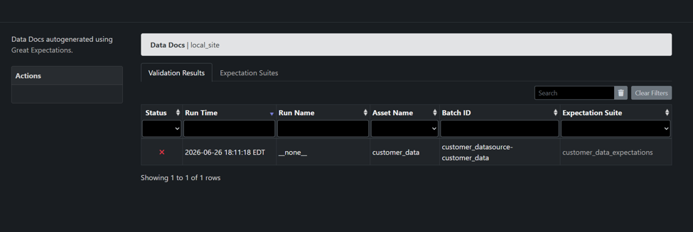
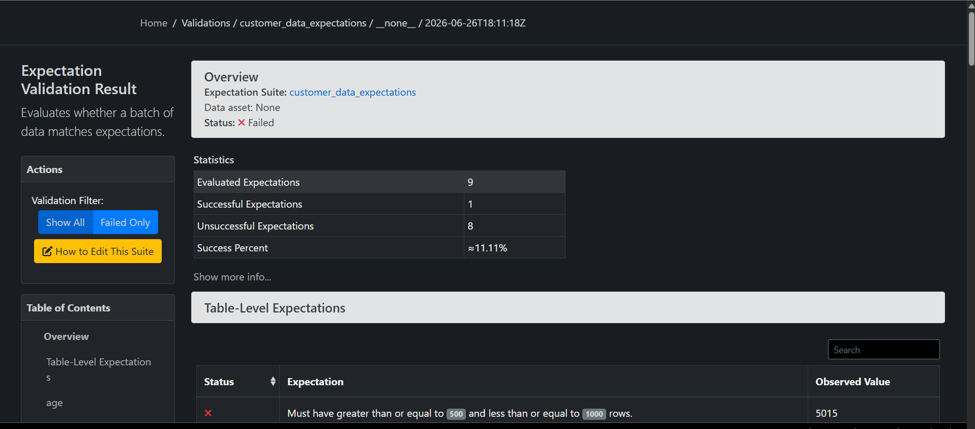
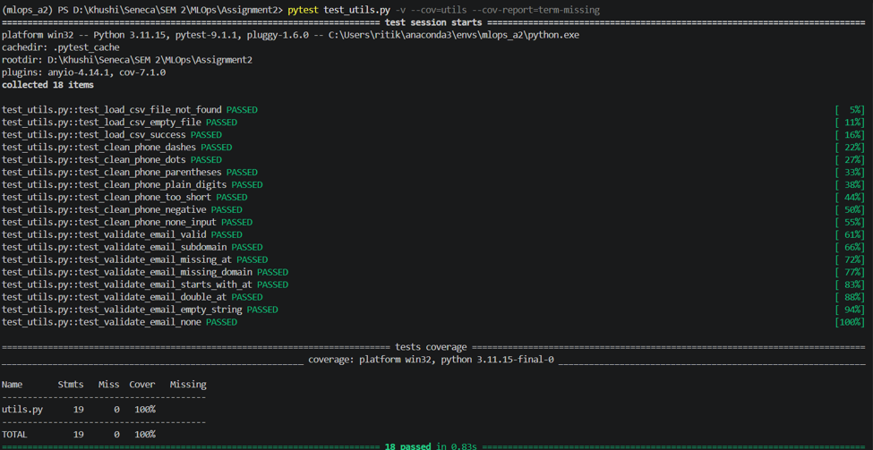

# Assignment 2 Report : Data Validation & Testing

**Course:** MAI201 : MLOps 
**Prepared By:** Ritika Lal (130865256)
**Dataset:** `customer_data.csv` (5,015 rows)
**Tooling:** Great Expectations 1.18.2, pandas 3.0.3, pytest 9.1.1, pytest-cov 7.1.0

---

## Table of Contents

- [Assignment 2 Report : Data Validation \& Testing](#assignment-2-report--data-validation--testing)
  - [Table of Contents](#table-of-contents)
  - [1. Overview](#1-overview)
  - [2. Great Expectations Setup](#2-great-expectations-setup)
  - [3. Expectations Created](#3-expectations-created)
  - [4. Great Expectations Validation Results](#4-great-expectations-validation-results)
    - [Summary Statistics](#summary-statistics)
  - [5. Data Quality Issues Found](#5-data-quality-issues-found)
  - [6. pytest Unit Test Results](#6-pytest-unit-test-results)
  - [7. Reflection: Which Data Quality Issue Would Most Impact ML Model Performance?](#7-reflection-which-data-quality-issue-would-most-impact-ml-model-performance)

---

## 1. Overview

This assignment validates a deliberately messy dataset, `customer_data.csv`, using **Great Expectations** for data quality checks and **pytest** for unit testing supporting utility functions. No model training was required, the focus is entirely on the data validation component of an MLOps pipeline: detecting and documenting data quality issues before they reach a training step.

The dataset was known to contain:

- Missing values in `age`, `email`, and `salary`
- Duplicate customer records
- Out-of-range values (`age` > 120, negative `salary`)
- Invalid email formats and inconsistent phone number formats
- `salary` stored as a string with dollar signs

---

## 2. Great Expectations Setup

| Item                  | Detail                                                                                            |
| --------------------- | ------------------------------------------------------------------------------------------------- |
| Library version       | Great Expectations 1.18.2                                                                         |
| Context type          | `FileDataContext` (`gx.get_context(mode="file")`)                                             |
| Data source           | Pandas datasource (`customer_datasource`) over an in-memory DataFrame asset (`customer_data`) |
| Batch definition      | `customer_batch` (whole-dataframe batch)                                                        |
| Expectation suite     | `customer_data_expectations`                                                                    |
| Validation definition | `customer_validation`                                                                           |

The project folder structure:

```
Assignment2/
├── customer_data.csv
├── validate.py
├── utils.py
├── test_utils.py
├── requirements.txt
├── assignment2_report.md
├── screenshots/
│   ├── data_quality_issues.png
│   ├── gx_validation_result1.png
│   ├── gx_validation_result2.png
│   └── pytest_execution_result.png
└── gx/                     ← auto-created by Great Expectations
```

---

## 3. Expectations Created

All required expectations were implemented in the `customer_data_expectations` suite:

| # | Column          | Expectation                              | Parameters                                           |
| - | --------------- | ---------------------------------------- | ---------------------------------------------------- |
| 1 | `customer_id` | `expect_column_values_to_not_be_null`  | —                                                   |
| 2 | `customer_id` | `expect_column_values_to_be_unique`    | —                                                   |
| 3 | `age`         | `expect_column_values_to_be_between`   | `min_value=0`, `max_value=120`                   |
| 4 | `email`       | `expect_column_values_to_match_regex`  | `^[a-zA-Z0-9_.+-]+@[a-zA-Z0-9-]+\.[a-zA-Z0-9-.]+$` |
| 5 | `salary`      | `expect_column_values_to_not_be_null`  | `mostly=0.95`                                      |
| 6 | `country`     | `expect_column_values_to_be_in_set`    | `["USA", "Canada", "UK", "Australia"]`             |
| 7 | `signup_date` | `expect_column_values_to_match_regex`  | Datetime format                                      |
| 8 | `phone`       | `expect_column_values_to_match_regex`  | Flexible phone regex                                 |
| 9 | `TABLE`       | `expect_table_row_count_to_be_between` | `min_value=500`, `max_value=1000`                |

---

## 4. Great Expectations Validation Results

The suite was run against the full 5,015-row dataset. **Overall result: FAILED** : 1 of 9 expectations passed.





### Summary Statistics

| Metric                 | Value   |
| ---------------------- | ------- |
| Rows loaded            | 5,015   |
| Expectations evaluated | 9       |
| Passed                 | 1       |
| Failed                 | 8       |
| Success rate           | ≈11.1% |

The full Great Expectations Data Docs HTML report was generated and saved at:
`gx/uncommitted/data_docs/local_site/index.html`

---

## 5. Data Quality Issues Found

| # | Column          | Expectation                     | Count           | % of Rows | Status  |
| - | --------------- | ------------------------------- | --------------- | --------- | ------- |
| 1 | `customer_id` | Not null                        | 150             | 3.0%      | ❌ FAIL |
| 2 | `customer_id` | Unique                          | 568             | 11.7%     | ❌ FAIL |
| 3 | `age`         | Between 0–120                  | 384             | 7.9%      | ❌ FAIL |
| 4 | `email`       | Valid format (regex)            | 346             | 7.6%      | ❌ FAIL |
| 5 | `salary`      | Not null (≥95% required)       | 425             | 8.5%      | ❌ FAIL |
| 6 | `country`     | In {USA, Canada, UK, Australia} | 301             | 6.1%      | ❌ FAIL |
| 7 | `signup_date` | Valid date format               | 64              | 1.3%      | ❌ FAIL |
| 8 | `phone`       | Valid format                    | -               | -         | ✅ PASS |
| 9 | `TABLE`       | Row count between 500–1000     | Observed: 5,015 | -         | ❌ FAIL |

**Total issues found: 8**

---

## 6. pytest Unit Test Results

Unit tests were written for all three required utility functions:

| Function                  | Test Coverage                                                                                                                    |
| ------------------------- | -------------------------------------------------------------------------------------------------------------------------------- |
| `load_csv(filepath)`    | File-not-found, empty-file, and successful-load cases                                                                            |
| `clean_phone(phone)`    | Multiple input formats (dashes, dots, parentheses, plain digits) and invalid inputs (too short, negative,`None`)               |
| `validate_email(email)` | Valid emails (including subdomains), and invalid edge cases (missing`@`, missing domain, double `@`, empty string, `None`) |

**Result: 18/18 tests passed**, with **100% statement coverage** on `utils.py` (19/19 statements, 0 missed), verified via `pytest-cov`.



```
collected 18 items
18 passed in 0.83s

Name        Stmts   Miss  Cover
-------------------------------
utils.py       19      0   100%
-------------------------------
TOTAL          19      0   100%
```

---

## 7. Reflection: Which Data Quality Issue Would Most Impact ML Model Performance?

Of the issue types this dataset was built to contain missing values, duplicates, out-of-range values, invalid formats, and salary stored as a dollar-formatted string, the **missing `salary` values** (425 rows, 8.5%) would most damage downstream model performance.

**Why the others are lower-risk:**

- **Duplicate `customer_id` records** (568 rows) are a deduplication fix, not a feature problem `drop_duplicates()` removes them with no effect on what the model learns.
- **Out-of-range `age`** (384 rows) is trivially detectable and correctable with a bounds check or clip; no value needs to be guessed.
- **Invalid `email` format** (346 rows) affect identifier fields, not predictive features a model would actually train on.
- **Salary stored as a string with `$` signs** is a parsing bug, not a data-quality bug - stripping `$`/commas and casting to float fully recovers the original value with zero information loss.

**Why missing salary is different.** Salary is one of the only genuinely predictive numeric fields in this schema - it plausibly correlates with whatever target a model here would be built for (creditworthiness, spend, churn). That makes its missingness uniquely costly:

1. **Imputation flattens signal.** Filling 425 missing values with the column mean/median compresses variance in the one feature most likely to carry real predictive power.
2. **Missingness is likely not random.** If certain customers ex. gig workers, the newly unemployed, anyone more guarded about income are more likely to skip this field, mean-imputation doesn't add neutral noise. It overwrites exactly the signal that distinguished them, so the model learns a salary relationship calibrated only on customers who disclosed it, then silently misapplies that relationship to the 8.5% who didn't.

In the end, every other issue in this dataset has a fix that doesn't cost anything like clean it up and the data is just as good as before. Missing salary is the one place where any fix has a price: drop the rows and the model sees less data, or fill in a guess and the model learns from a number that isn't real. That trade-off is exactly why this issue matters more than the rest.
